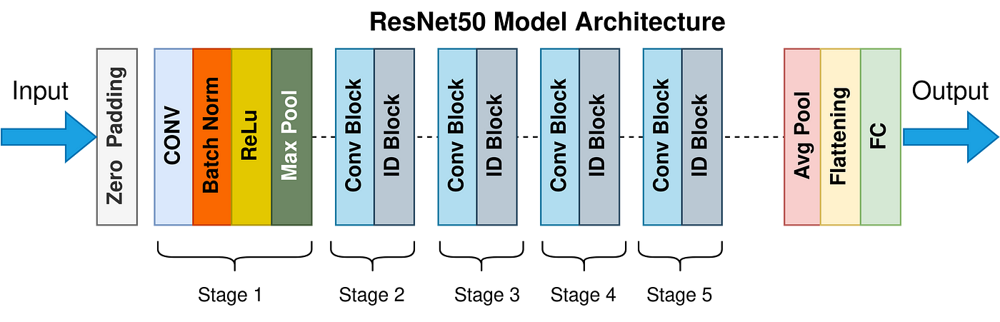

[![LinkedIn][linkedin-shield]][linkedin-url]
[![MIT License][license-shield]][license-url]

<br />
<div align="center">
  <a href="https://github.com/AdamSkog/Scoliosis-Xray-Classification">
    
  </a>

<h2 align="center">Scoliosis X-ray Classification</h2>

  <p align="center">
    A machine learning project for classifying scoliosis from X-ray images.
    <br />
    <a href="https://github.com/AdamSkog/Scoliosis-Xray-Classification/issues">Report Bug</a>
    ·
    <a href="http://52.12.96.55:6006/">View TensorBoard</a>
    ·
    <a href="https://github.com/AdamSkog/Scoliosis-Xray-Classification/pulls">Request Feature</a>
  </p>
</div>

---

## Table of Contents
- [Table of Contents](#table-of-contents)
- [About the Project](#about-the-project)
  - [Built With](#built-with)
- [Getting Started](#getting-started)
  - [Prerequisites](#prerequisites)
  - [Installation](#installation)
- [Model](#model)
- [Model](#model-1)
  - [Model Performance](#model-performance)
- [AWS Fargate Deployment](#aws-fargate-deployment)
  - [Why AWS Fargate?](#why-aws-fargate)
- [TensorBoard](#tensorboard)
- [Contributing](#contributing)
- [License](#license)
- [Contact](#contact)

## About the Project
This project aims to classify scoliosis from X-ray images using deep learning techniques. The model is trained on a dataset of X-ray images labeled as either "Normal" or "Scoliosis".

### Built With

[![Python][python-shield]][python-url]
[![PyTorch][pytorch-shield]][pytorch-url]
[![Docker][docker-shield]][docker-url]
[![AWSFargate][aws-fargate-shield]][aws-fargate-url]

## Getting Started
To get a local copy up and running, follow these steps.

### Prerequisites
- Python 3.11
- Docker
- AWS CLI

### Installation
1. Clone the repo:
   ```sh
   git clone https://github.com/AdamSkog/Scoliosis-Classification-Project.git
   ```

2. Install the required packages:
    ```sh
    pip install -r requirements.txt
    ```

## Model
The model used in this project is based on the ResNet architecture, which is well-suited for biomedical image processing due to its ability to handle complex image features.
## Model
I chose ResNet50 as the pre-trained model for this project for several reasons:

1. **Deep Architecture**: ResNet50 is a deep convolutional neural network with 50 layers, which allows it to learn complex features from images effectively. This is particularly important for classifying X-ray images, where subtle differences can be crucial for accurate diagnosis.

2. **Residual Connections**: The residual connections in ResNet50 help mitigate the vanishing gradient problem, making it easier to train very deep networks. This is beneficial for achieving high accuracy in medical image classification tasks, such as detecting scoliosis from X-ray images.

3. **Pre-trained Weights**: ResNet50 comes with pre-trained weights on the ImageNet dataset, providing a strong starting point for transfer learning. Given that I only have access to a limited dataset of around 250 images, transfer learning is likely a better solution than building a CNN from scratch. The pre-trained model can leverage learned features from a large and varied dataset, which is crucial when working with small datasets.

4. **Proven Performance**: ResNet50 has been widely used and validated in various image classification tasks, including biomedical image processing. Its proven track record makes it a reliable choice for this project, ensuring that I can achieve high performance in classifying scoliosis from X-ray images.

5. **Feature Extraction**: The architecture is well-suited for extracting meaningful features from medical images, which is crucial for accurate classification in tasks like scoliosis detection.

6. **Learning Experience**: Simply put, using ResNet50 for transfer learning also provides me with valuable experience in applying transfer learning techniques. This is an important skill, as transfer learning is often more effective than training models from scratch, especially when dealing with limited data.

By leveraging ResNet50, I can take advantage of its robust architecture and pre-trained weights to achieve high performance in classifying scoliosis from X-ray images, while also gaining experience in transfer learning techniques.

### Model Performance
The model achieved an accuracy of **0.95** on the test set, demonstrating its effectiveness in classifying scoliosis from X-ray images.



[**--Learn more about ResNet50 here--**](https://blog.roboflow.com/what-is-resnet-50/#:~:text=ResNet%2D50%20is%20a%20convolutional,it%2C%20and%20categorize%20them%20accordingly)

## AWS Fargate Deployment
The project is deployed using AWS Fargate. Below is the architecture diagram for the deployment.
```
+-------------------+       +-------------------+       +-------------------+
|                   |       |                   |       |                   |
|    AWS IAM        |       |    Amazon ECR     |       |    AWS ECS        |
|                   |       |                   |       |                   |
| - IAM Role        |       | - Docker Image    |       | - ECS Cluster     |
|                   |       |                   |       | - Task Definition |
|                   |       |                   |       | - Fargate Service |
+-------------------+       +-------------------+       +-------------------+
         |                           |                           |
         |                           |                           |
         |                           |                           |
         v                           v                           v
+-------------------+       +-------------------+       +-------------------+
|                   |       |                   |       |                   |
|    AWS VPC        |       |    AWS Subnet     |       |    Security Group |
|                   |       |                   |       |                   |
| - VPC             |       | - Public Subnet   |       | - Inbound Rule    |
| - Internet Gateway|       |                   |       |   (Port 6006)     |
|                   |       |                   |       |                   |
+-------------------+       +-------------------+       +-------------------+
         |                           |                           |
         |                           |                           |
         |                           |                           |
         v                           v                           v
+--------------------------------------------------------------------------+
|                                                                          |
|                             AWS Fargate                                  |
|                                                                          |
| - Runs ECS Task                                                          |
| - Uses Docker Image from ECR                                             |
| - Uses IAM Role for permissions                                          |
| - Runs in VPC with Public Subnet                                         |
| - Accessible via Security Group allowing inbound traffic on Port 6006    |
|                                                                          |
+--------------------------------------------------------------------------+
         |
         |
         v
+-------------------+
|                   |
|    TensorBoard    |
|                   |
| - Accessible via  |
|   Public IP       |
|(52.12.96.55:6006/)|
|                   |
+-------------------+
```

### Why AWS Fargate?

1. **Serverless Architecture**: AWS Fargate is a serverless compute engine, which means I don't have to manage the underlying infrastructure. This is particularly advantageous for this project because the TensorBoard will not be viewed frequently enough to justify the cost and maintenance of an EC2 instance.

2. **Scalability**: Fargate automatically scales the compute resources based on the workload. This ensures that the TensorBoard service can handle varying levels of traffic without manual intervention.

3. **Cost-Effective**: Since Fargate charges based on the resources used per task, it is more cost-effective for a project like this where the TensorBoard usage is sporadic.

4. **Simplified Management**: With Fargate, I don't need to worry about provisioning, configuring, or scaling clusters of virtual machines. This allows me to focus more on the development and improvement of the machine learning model rather than infrastructure management.

5. **Integration with AWS Services**: Fargate integrates seamlessly with other AWS services like Amazon ECR for container storage, AWS IAM for security, and Amazon VPC for networking. This mades it easier to set up a secure and efficient deployment pipeline.

6. **Security**: Fargate provides built-in security features such as task-level isolation and integration with AWS IAM roles, ensuring that my TensorBoard service runs in a secure environment.


## TensorBoard
You can monitor the training process using [TensorBoard](http://52.12.96.55:6006/).

## Contributing
Contributions are what make the open-source community such an amazing place to learn, inspire, and create. Any contributions you make are greatly appreciated.

1. Fork the Project
2. Create your Feature Branch (git checkout -b feature/AmazingFeature)
3. Commit your Changes (git commit -m 'Add some AmazingFeature')
4. Push to the Branch (git push origin feature/AmazingFeature)
5. Open a Pull Request

## License
Distributed under the MIT License. See LICENSE for more information.

## Contact
Adam Skoglund - @AdamSkog - adamskoglund2022@gmail.com


<!-- MARKDOWN LINKS & IMAGES -->
<!-- https://www.markdownguide.org/basic-syntax/#reference-style-links -->
[license-shield]: https://img.shields.io/badge/MIT-red?style=for-the-badge&label=LICENSE
[license-url]: https://github.com/AdamSkog/Scoliosis-Xray-Classification/blob/main/LICENSE

[linkedin-shield]: https://img.shields.io/badge/-LinkedIn-black.svg?style=for-the-badge&logo=linkedin&colorB=555
[linkedin-url]: https://linkedin.com/in/adam-skoglund

[python-shield]: https://img.shields.io/badge/Python-%233776AB?style=for-the-badge&logo=Python&labelColor=black
[python-url]: https://python.org

[pytorch-shield]: https://img.shields.io/badge/PyTorch-%23EE4C2C?style=for-the-badge&logo=PyTorch&labelColor=black
[pytorch-url]: https://pytorch.org

[docker-shield]: https://img.shields.io/badge/Docker-%25?style=for-the-badge&logo=Docker&labelColor=black&color=blue
[docker-url]: https://www.docker.com/

[aws-fargate-shield]: https://img.shields.io/badge/AWS%20Fargate-%25?style=for-the-badge&logo=awsfargate&labelColor=black&color=orange
[aws-fargate-url]: https://aws.amazon.com/fargate/
